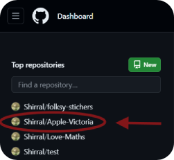

# Apple Victoria

["Apple Victoria"](https://shirral.github.io/Apple-Victoria/) is a short game about picking apples created as a project meant to teach me working with Javascript and jQuery. The goal of the game is simple: fill the fruit bins with many apples as you can while maintaining the quality of the fruit! Pick the good apples, drop the bad apples to the ground - and be careful not to mix them up! Your supervisor will not be impressed if you do...

Left click or tap on an apple to pick it; right click or swipe it down to drop it to the ground. Once the tree has been stripped of apples, you will move onto the next tree. It might be filled with apples, or it might only have a few fruits. That happens! 

When you fill a bin, a new one will be brought in. You need to fill a minimum of 3.5 bins. Good luck!

## User Experience & User Interface (UX/UI)

### Site goals

The goal of the site is to deliver a short humorous interactive experience to the user. It is inspired by my time spent at an apple farm as a picker and while it's not a serious and technically correct simulation, it provides some glimpses into how a day of picking might look like, what are the main requirements set upon the pickers, and how is your progress at the end of the day judged. Because of this, it should do a decent job at satisfying some of the curiosity the user might have about this like of work, too.

### User stories

**First time visitor goals:**

* As a first time visitor, I am bored and I'm looking for some entertainment; I want to have fun.
* As a first time visitor, I have a few minutes to pass and I'm looking for something to do that won't take a long time.
* As a first time visitor, I am curious about apple picking and want to see how an apple picking simulator might work.

**Returning visitor goals:**

* As a returning visitor, I want to try to beat my previous score in the game.
* As a returning visitor, I want to try to share the game with somebody who might find it funny - perhaps someone who has worked as an apple picker at a farm before.

### Design

**Colour scheme**

Black has been chosen as the default colour of the in-game text, buttons, and shadows of several design elements. White has been used as an accent colour. As the game uses full-screen image backgrounds for all of its screens, the other leading colours have been chosen to match the colours of the background images.

The starting screen focuses on pastel yellow and warm red, matching the golden light in the orchard and the red apples:

The end screen features two different shades of green - a very light yellowish green and a very dark cyan. Because the latter is almost black, it has been used to replace the black in the "GIVE IT ANOTHER GO!" button to fit with the design of the screen better: 

The overlay with the controls instructions uses white as its background, black as the main colour of the information presented, and the same pastel yellow as the starting screen as the accent colour:

The main game screen is a little different as it showcases hand-drawn images of the apple tree, the apples, and the apple bin. The design goal of these is to give the player accurate information about their progress (changing colours of the apple bin, going from colourless through oragne and yellow to green when it's full) and to create a challenge of quickly telling apart different kinds of apples - good and bad - many of which might look similar at a first glance, but which show clear signs of being rotten upon closer inspection. While I tried to provide as varied colours for the different kinds of apples as possible, I was sticking to the shades found in different kinds of apples in real life.

The background was made to visually represent a tree that is being picked, including the animation representing the player moving on to the next tree filled with new apples, but the main focus of the player's atention should be on the apples themselves. For this reason, the background features muted shades of green that don't distract from the bright colours of the apples.

**Typography**

The website features two fonts:

* **Sedan SC** - a Garalde font used for the h1 headings and buttons, 
* **Josefin Sans** - a sans-serif font used for any other text.

Sedan SC is a serif font that conveys the feelings of grandeur and refinement; it was perfect for the project logo, the announcement of the player's victory or defeat, the clock reminding the player of the inexorable passage of time, and the call-to-action buttons.

In contrast, Josefin Sans is a rounded sans-serif font that invokes friendliness. It is albo easy to read. It is used to convery the instructions about the gameplay to the player, as well as the detailed information about their performance.

Both fonts are served by Google Fonts. Garamond has been provided as a fallback font for Sedan SC, as it's also a Garalde typeface; Arial has been provided as fallback for Josefin Sans as the most rounded of the web safe sans-serif fonts currently available.

**Imagery**

The imagery of the project revolves around one theme: apples. Opening the page with the game, the user is greeted by a full-screen background picture of an apple orchard during the picking season with a bin filled with freshly picked apples - this is to let them know immediately what the game will be about. The colours are pleasant, warm, and inviting.

The end screen is fresh and crisp, featuring an image of a thick apple leafage with apples growing among them. It provides a fitting background for the information about the player's performance in the orchard.

The main game screen, once more, is a bit different from the rest. While the starting screen and the end screen serve the function of providing the player with information about the game, this screen is where the game actually happens. The function of the visual elements is not just to look nice; they need to provide very specific information to the player. For this reason, I needed full control over what the visual elements are going to look like. All the images there, including the animated images showing the controls on the overlay, are hand-drawn and kept in the same cartoonish visual style. It's meant to be simple and fun.

**Wireframes**

As for this project I did not need to cooperate with other developers, I did not see the need to use digital tools to make "proper" wireframes. I find it much more efficient to sketch out my ideas on paper. While I could had redone them with digital tools later to make them look pretty - and it is something I plan on doing in the future when I need to communicate my ideas to others clearly in the planning stage - in this case, that would had been a waste of time.

Below are the sketches made in the planning stage of working on the project, along with some early notes - please excuse the lined paper, sadly I had no plain paper available at the time.

At the very beginning of the project work I intented to build a more advanced simulator including the elements and gameplay known from visual novel games. I wanted to create a coherent story around the main apple picking part, including a cast of characters, several different endings, and twists that can affect the gameplay. Fortunately, it was pointed out to me that the scope of that idea might had been a bit too broad for my very first Javascript project, and that in order to make sure I finish before the deadline, it might be good to just focus on the main gameplay itself. Here is a screenshot of the skeleton of the visual-novel style screen I intended to use:

Early prototype of the picking screen:

## Features

### Responsive design

The website responds to a wide variety of screen sizes. Individual elements of each page have been given their own media queries featuring breakpoints adjusted as needed for the element to look good on a particular screen instead of picking a few set breakpoints and ignoring the screens in between which might need additional adjustments.

Moreover, a different set of controls has been prepared for mobile devices and pointer devices: apples are picked with a left click and dropped with a right click on the devices using a computer mouse or touchpads, while on the devices with touchscreens the same actions are done through tapping and swiping down. The right set of controls is displayed, depending on the device.

### Start screen

The start screen introduces the player to the game and provides them with the information on what they need to do in order to beat it. It features a simple structure fit for the purpose: the name of the project at the top, an easy to read section with text on a lighter background (scrollable on smaller screens), and a button which brings the user to the main game screen once it is clicked. Behind it all is a  full-screen background image of an apple orchard on a sunny Autumn day.

### Main game screen

* **Controls instructions overlay:** the first thing the player sees once they are presented with the main game screen is an overlay explaining the controls of the game. It features animated gifs showing the controls visually and textual descriptions, different for pointer devices and for touch devices. Below the instructions is a button that starts the game.

* **Timer:** On the top of the main game screen, there is a clock showing in-game time. It starts running once the game starts, updating by 15 minutes every 5 seconds. The in-game time represents a typical working day for the pickers at an apple farm: starting at 8:00 and finishing at 16:00. Of course, sitting in front of the screen and clicking on apples the entire day would be extremely daunting, to the time was sped up to fit the entire day of apple picking within about 2,5 minutes of gameplay. When the timer hits 16:00, the game ends and the player is brought to the end screen.

* **Randomly generated apples:** The apples generate on the main game screen in a different way every time the user starts the game or picks/drops all the apples from the current tree. There are six kinds of apples - three good, three bad - generating with a similar probability. Every apple gets assigned a random position within the area reserved for the apple generation; the number of apples generating within a single batch is also randomized between 5-40. It reflects the reality of an apple orchard where one tree might be filled with lovely fruits while the next one might be nearly barren; one apple might be picture-perfect and the next one - half-rotten.

  

  The apples can be either **picked** or **dropped**. Both actions remove the apple object from the DOM; picking it updates the variables responsible for measuring the player's performance.

  

* **Apple bin:** The apple bin serves as a visual representation of the player's progress. The bin picture is updated as the player picks more and more apples, showing how full the current bin is. When the bin gets filled, it's coloured fully green and an animation is run that moves it off the screen; then, a "new" empty bin is brought in from the other side of the screen. This indicates that the player has successfully finished picking a full bin of apples and is now starting to fill another bin.

  

* **Apple tree background:** Similarly to the apple bin image, the picture of the apple tree in the background is animated out of the screen and back into the screen from the other side once the player has picked or dropped all the apples on the screen. It visually represents the apple picker moving on to the next tree.

  

### End screen

* **Game outcome section:** The first and main bit of information the player sees when the time runs out and the game finishes. It is shown on the very top of the screen, in big letters, to give the player immediate feedback on the outcome of their efforts - whether they won ("APPLE VICTORIA!") or lost ("APPLE DEFEAT!").

  

* **Outcome text section:** A more detailed breakdown of the player's performance, including the information on the amount of apple bins they managed to pick and the percentage of the apples picked that was rotten. Based on these two, the flavour text - the supervisor's evaluation - is displayed. There are several different outcomes possible for the player to get. Scrollable on smaller screens.

  

* **Score section:** This is where the player's score is displayed. If they lost, it will always be 0. If they won, it will show the amount of apples they managed to pick.

  

* **Try again button:** A button that restarts the game, bringing the player back to the main game screen, if they wish to give it another go and better their score.

  

### Future features

I would like to continue the development of the project to eventually bring it to the form I initially imagined. In particular, I would like to add the following features:

* **A storyline with a cast of characters and several different endings:** I would like the game to be story-driven, featuring a visual novel-style gameplay (before each work day starts and when it finishes), and the main apple-picking bit to serve more as a minigame that determines the further story developments rather than the main bit of the game.

* **Gameplay spanning over several days/weeks:** The player would start the game as a new picker who isn't yet proficient in the art of apple picking. The difficulty of the game would be set high enough for it to be physically impossible for the player to gather enough apples on the first day; they would need to learn tips and tricks from the other pickers in order to succeed. The game would span over a week or two - the trial period after which the picker's performance is evaluated. If they have learned to pick fast enough, with enough attention to detail - they win. If not - they get sent to the packhouse to spend the rest of the season in misery (they lose).

* **Power-ups:** A variety power-ups that make the picking easier or faster - some of them being the "white hat" techniques, like teaming up with another picker (one of the game characters) or leaving for the orchard early and claiming a better row to pick in (one that features trees with less bad apples - it's a thing in real-file apple-picking!), and some of them being "black hat" tricks which will help you, but might get you sacked if you get caught using them - like kicking the trees to drop all of the remaining apples all at once or hiding a layer of bad apples on the very bottom of the bin where the supervisors aren't likely to spot them. The power-ups could be learned from the in-game characters through talking to them during the visual novel-style part of the game and then used in the apple picking bit.

* **Supervisor inspections:** Throughout the picking day, the player character would get randomly visited by the supervisor who would inspect the contents of their current bin, and provide feedback. If they catch the player using any of the "forbidden" power-ups, or filling the bin with too many bad apples, they might issue a warning. Too many of these and the game ends sooner with the player character getting fired.

## Testing

### Validator Testing

* **HTML:**

  The initial testing has revealed a `` tag that was not closed properly and the lack of a space character between the "id" and "class" attributes in two divs of the end screen. This has been fixed.

  The validator has also thrown a warning about the empty heading in the end screen that gets filled with the information on the player's victory or defeat through Javascript at the end of the game.

  It has also shown errors relating to the missing `alt` attribute for the image tags. I initially didn't see the purpose of adding it - the project is a game that is relies on visual imagery and the speed of reaction; the images don't fill any of the functions that normally call for using the attribute in web projects. I have added the attribute in the end, as there is no harm in that and it might be useful to be able to tell the images apart in case they fail to load.

  The second round of testing only showed the warning about the empty heading.

  [W3C validator](https://validator.w3.org/) was used.

* **CSS:**

  The validator did not find any errors.
  
  Warnings were shown about the vendor extensions I used to ensure that the styling I'm using will work on all the major browsers: `-webkit-user-select`, `-ms-user-select`, `-ms-overflow-style` and `::-webkit-scrollbar`.

  [W3C Jigsaw validator](https://jigsaw.w3.org/css-validator/) was used.

* **JS:**

  The validator has found one unnecessary semicolon at the end of a function definition. The semicolon was removed.

  [JQuery Validator](https://www.utilities-online.info/jquery-validator) was used.

* **Performance & best practices:**

  While [Lighthouse](https://chrome.google.com/webstore/detail/lighthouse/blipmdconlkpinefehnmjammfjpmpbjk) was satisfied with the page load of the project (all of the statistics in the green zone, ranging between 90-100% on both desktop and mobile device evaluation), it was less impressed when I evaluated the project using its Timespan mode so that the whole project and its interactivity would be assessed. Best Practices were rated 8/8, but the Performance was rated 14/22 (yellow zone).

  After I implemented some of the suggested changes (compressing the background images into the WebP format, adding the missing meta tag attribute), the latter went up to 17/22.

### Manual testing: Features

| Feature       | Expected behaviour | Action  | Result |
| ------------- |--------------------| --------|--------|
| *Responsive design* | When the project is viewed on different kinds of devices with different screen sizes, the design should remain clear and functional. The elements of the starting screen and end screen should resize to match the window size; the apples should generate on a smaller area on smaller screens, and be smaller, and take up more space on screens where more space is available. No elements should go beyond the edge of the screen. | The project is opened and the game is played on several different devices: a laptop (Acer Nitro 5), an Android phone (Ulephone Power Armor 14), and an iOS tablet (iPad Air 4th Generation). | The elements of the project respond to the different screen sizes correctly, changing their proportions to preserve the design and functionality of the game. |
| *Start screen* | The starting screen should load all its elements: the main heading, the div element with the main text, the background image, and the "TO THE ORCHARD!" button-like link. The main text should be scrollable within the bounds of the div on the smaller screens.  | The page is loaded. Scrolling the main text is attempted on a mobile phone (Ulephone Power Armor 14). | All of the elements are loaded correctly. The main text scrolls within its div on a mobile device. |
| *Start screen: "TO THE ORCHARD!" button* | The button should change its colour scheme (black should change to red) once it is hovered upon with a pointer. The starting screen should be replaced with the main game screen with the controls instructions overlay once the button is clicked. | The button is hovered over with a cursor, then it is clicked. | The button changes its colour scheme correctly. The starting screen is replaced with the main game screen with the controls instructions overlay. |
| *Controls instructions overlay* | The controls instructions overlay should be shown on top of the tree background once the main game screen is loaded. The animated gif images presenting the actions required from the player to pick and drop apples should display correcly and show the animation. Each image should be accompanied by a textual description of the action either directly below it (in case of bigger screens) or to its side (in case of small screens). Below them, a "START THE DAY!" button should be displayed. | The main game screen is loaded. | All of the elements load and display correctly. |
| *Controls instructions overlay: "START THE DAY!" button* | The button should change its colour scheme (black should change to pastel yellow, and vice versa; a thin black outline should appear) once it is hovered upon with a pointer. The overlay should disappear, the main game elements (timer, bin, apples) should be shown, and the game should begin. | The button is hovered over with a cursor, then it is clicked. | The button changes its colour scheme correctly. The overlay is hidden, the main game elements are shown, and the game starts correctly. |
| *Timer* | The timer should update the hour shown on the screen by 15 minutes every 5 seconds. When it reaches 16:00, the game should end and the main game screen should be replaced with the end screen. | The game is started and the timer is allowed to run until the hour shown in the screen reaches 16:00. | The timer updates the hour shown on the screen correctly. The game ends and the end screen is shown once it reaches 16:00 with all of its elements loading correctly. |
| *Randomly generated apples* | When the game starts, a random amount of apples between 5-40 appears on the screen, in randomly determined positions between the timer and the apple bin. While it's okay for the apples to cover the top of the bin, they should never cover the timer or go over the edge of the screen. The number of apples generated should never be below 5 or above 40 at a time. All 6 different kinds of apples (3 good, 3 bad) should be generating with a similar frequency. | The game is started multiple times so that several batches of apples are generated. | The apples are generated correctly. |
| *Apple bin* | The picture of the apple bin changes, showing the level of the fullness of the bin, once the following numbers of apples in the current bin are reached: 1, 13, 26, 40. When the bin is full, an animation is triggered that moved the picture of the full bin off the side of the screen, to the left, and brings in a picture of an empty bin back to the centre of the screen, from the right. | 40 apple images are clicked on. | The bin image swaps are happening at the right thresholds of apples picked. At 40 apples, the bin animation is triggered. It runs as expected. |
| *Apple tree background* | When the game is started and the main game screen is emptied of apples (they have been picked or dropped), the background image of an apple tree is animated off the side of the screen, to the left, and then slides back into its central position on the screen from the right. | The game is started and all the apples that generated are clicked on. | When the screen is empty of apples, the background image animation is triggered. It runs as expected. |
| *Game outcome section* | The heading at the very top of the page should say either "APPLE VICTORIA!" if the player has met the victory conditions or "APPLE DEFEAT!" if they have not. | The game is played twice. The first time, to win (good apples are picked, bad apples are dropped); the second time - to fail (no apples are picked or dropped). | The heading shows the correct message in both scenarios. |
| *Outcome text section* | The outcome text should inform the player how many bins of apples they picked and what percentage of them were rotten. It should provide feedback on how good the player's performance was. There are several different outcomes dependent on the player's speed and accuracy. | The game was played several times to achieve the following results: 3.5+ bins of apples picked, none of them rotten; 3.5+ bins of apples picked, one of them rotten; 3.5+ bins of apples picked, less than 5% of them rotten; 3.5+ bins of apples picked, 5%+ of them rotten; less than 3.5+ bins of apples picked, less than 5% of them rotten; less than 3.5+ bins of apples picked, 5%+ of them rotten. | Picking 0, 1, less than 5% and 5%+ of the bad apples have all shown different feedback on the amount of rotten apples in the second paragraph. The combinations 3.5+ bins, <5% rotten apples; 3.5+ bins, 5%+ rotten apples; <3.5 bins, <5% rotten apples; <3.5+ bins, 5%+ rotten apples have all brought different supervisor feedback messages in paragraphs 3, 4, and 5. |
| *Score section* | The score should display 0 if the player has not met the victory conditions. If they have, the score should display the amount of apples picked by the player. | The game is played twice. The first time, to win (good apples are picked, bad apples are dropped); the second time - to fail (only a few apples are picked). | The score displays 0 when the game is lost and a number of apples picked (in this case, 153) when it is won. |
| *Try again button* | The button should change its colour scheme (dark green should change to light green, and vice versa; the outline should disappear) once it is hovered upon with a pointer. When the button is clicked, the game should be reset and the player should be brought back to the main game screen with the controls instructions overlay, ready to start another round. | The button is hovered over with a cursor, then it is clicked. | The button changes its colour scheme correctly. The end screen is replaced with the main game screen with the controls instructions overlay. |

### Manual Testing: Testing User Stories from the UX/UI section

**1. First Time Visitor Goals**

* *As a first time visitor, I am bored and I'm looking for some entertainment; I want to have fun.*

  * The user is brought to the starting screen. The imagery and the story introduction suggest the website might have something to do with picking apples; hopefully that makes the user curious. If they read the emphasised line on the bottom or click on the button, they will realise it's a game they can play to fend off their boredom for a bit. They click on the "GO TO THE ORCHARD!" button, learn the controls, click on the "START THE DAY!" button and play the game.

* *As a first time visitor, I have a few minutes to pass and I'm looking for something to do that won't take a long time.*

  * The user is brought to the starting screen. If they read the emphasised line on the bottom, they will realise the website contains a game that only takes about 3 minutes to play - just what they need. They can now click on the "GO TO THE ORCHARD!" button and play the game.

* *As a first time visitor, I am curious about apple picking and want to see how an apple picking simulator might work.*

  * The user is brought to the starting screen where they are presented with the flavour text that details the basic rules of apple picking. Then, after they click on the "GO TO THE ORCHARD!" button and familiarise themselves with the controls, they start the game by clicking on the "START THE DAY!" button. During the gameplay, they get to put what they've just learned into practice. At the end, they receive an evaluation of their efforts which is what they would likely be told by their supervisor if they picked a similar amount of apples of a similar quality at a real-life commercial farm.

**2. Returning Visitor Goals**

* *As a returning visitor, I want to try to beat my previous score in the game.*

  * After having played the game once and receiving their evaluation, the user can click on the "GIVE IT ANOTHER GO!" button to play again and try to achieve a better result. They can also refresh the website to start the game again from the starting screen. The user can always navigate to the website after having closed the page to play the game again, too.

* *As a returning visitor, I want to try to share the game with somebody who might find it funny - perhaps someone who has worked as an apple picker at a farm before.*

  * The user can copy the website's address and paste it in a message to their friend or, if they're on a mobile device, tap on the "share" button in their browser to share the game with others.

### Further Testing

The website has been tested on a variety of screen sizes (resizing the browser window on desktop, tablet, smartphones), browsers (Chrome, Safari, Opera, Edge, Firefox), and devices. Family and friends have been asked to perform additional testing on devices I had no access to (Macbook, iPhone).

The game performed well on all of the devices and browsers tested, although there were some unexpected differences between them:

* The performance on Chrome on iPad Air (4th Edition) was not as smooth as on other devices using the same browser, nor as the same device running Safari. The browser struggled to register apples being tapped quickly one after another to be picked; it did not have the same problem with swiping on the apples to drop them, though.

* Microsoft Edge would sometimes display an image search icon on the clicked apples, which was easy to click on accidentally when picking another apple nearby. This would disrupt the gameplay as it would prompt the browser to run the image search in a window that would pop up to the right side of the screen. Sadly, a programmatical way of disabling it doesn't seem to exist at the moment; the feature can only be turned off locally on the user's device. 

## Bugs fixed & problems overcome

* it was possible to click on the same apple numerous times before it was revomed from the DOM, getting it counted as if the player has picked similar apples. This was fixed by adding a flag to the apple element the first time the user clicks on a given apple and checking for the presence of the flag any time an apple is clicked - if the flag was already there, the rest of the picking or dropping function would be ignored.

* the nextTree function would sometimes run several times, leading to several sets of apples generating all at once, if the player has been picking/dropping apples very quickly, making a lot of clicks. Adding the flags and the flag checks described above has solved this issue, too.

* the apple bin wouldn't always return to the central position after the animation of it being moved to the side and returning from the other side would finish. The way the bin images were being swapped while the animation was running was to blame; pre-loading all the images and using `.show()` and `.hide()` methods has solved the issue.

* accidentally dragging or selecting the apple images would stop the click event, interfering with the gameplay and making it impossible to play the game quickly as it's meant to be played. Adding `ondragstart="return false"` to the `<body>` element in the html file and the `user-select: none;`, `-webkit-user-select: none;` and `-ms-user-select: none;` rules to the css class applied to the apples and other chosen elements has solved the issue.

* adding a swipe event for the dropping action on mobile devices proved to be quite a challenge, even though I have found several external libraries that offer the functionality I needed. After a lot of trial and error, it turned out that my apple elements were too small for the script I used to work reliably; changing the settings in the downloaded library a little has solved the issue.

* the iPads allow for the display of the context menu if the user taps and holds on an apple or a bin. This has been successfully fixed by adding `-webkit-touch-callout: none;` to the css class used for preventing the selection of images.

* the second and following bins would not be positioned in the center of the screen after the window was resized. This happened both on computers and mobile devices (if the orientation was changed during the game) and was due to the fact that the nextBin function calculates the bin's current position to pass it to the animation, which  desn't accept standard values for centering, overriding the css margin settings from the stylesheet; the new position wouldn't be central anymore if the screen was suddenly resized. This has been fixed with using jQuery's `.resize` method to listen for any screen size changes, and to apply the original margin that centers it on the screen to the apple bin element.

## Technologies and Resources used

### Programming languages used:

* **HTML5**
* **CSS3**
* **JavaScript**

### Frameworks & Libraries Used:

* **[jQuery](https://jquery.com/)**
* **[swipe events by jquery](https://codepen.io/w3codemasters/pen/qvVwGQ)**
* **[Google Fonts](https://fonts.google.com/)**

### Software & other technologies used:

* **[Visual Studio Code(https://code.visualstudio.com/)]** - IDE the project was written in. Used with the **[Live Server (Five Server)](https://marketplace.visualstudio.com/items?itemName=yandeu.five-server)**, **[HTML Boilerplate](https://marketplace.visualstudio.com/items?itemName=sidthesloth.html5-boilerplate)** and **[IntelliSense for CSS class names in HTML](https://marketplace.visualstudio.com/items?itemName=Zignd.html-css-class-completion)** extensions.
* **[GitHub Desktop](https://github.com/apps/desktop)** - used for version control and pushing commits to GitHub.
* **[Canva](https://www.canva.com/)** - used to get the screens mockup base.
* **[Photopea](https://www.photopea.com/)** - used to prepare the images for the readme file.
* **[Procreate](https://procreate.com/)** - used to draw the images of the apple tree, the apples, the apple bins, and the static images for the animated gifs showing the controls.
* **[Ezgif](https://ezgif.com/maker)** - used to put the static images for the controls instructions gifs together into animated gif files and to convert video into gif files for the readme.
* **[Microsoft Copilot](https://copilot.microsoft.com/)** - used to create the background images for the starting screen and for the end screen.
* **[Img.Upscaler](https://imgupscaler.com/)** - used for upscaling the images generated with Copilot.
* **[IMAGECOLORPICKER](https://imagecolorpicker.com/)** - used to grab the colours to use in the design of the website from the generated images.
* **[Snipping Tool](https://apps.microsoft.com/detail/9mz95kl8mr0l?hl=en-US&gl=US)** - used to for the screen recording to create the animated gifs for the readme file.

### How-to references used:

* [right click event](https://api.jquery.com/contextmenu/)
* [swipe event](https://codepen.io/w3codemasters/pen/qvVwGQ )
* [checking if a div is empty](https://www.geeksforgeeks.org/how-to-check-an-html-element-is-empty-using-jquery/)
* [figuring out how to create the timer](https://www.w3schools.com/jsref/met_win_setinterval.asp), [another resource for this](https://developer.mozilla.org/en-US/docs/Web/API/setInterval)
* [rounding numbers to 1 decimal point](https://www.altcademy.com/blog/how-to-round-numbers-in-javascript/)
* [preventing user selection](https://www.w3schools.com/howto/howto_css_disable_text_selection.asp)
* [preventing dragging](https://stackoverflow.com/questions/62097523/disable-dragging-of-image-in-entire-project-html-pages)
* [hiding the scroll bar](https://www.w3schools.com/howto/howto_css_hide_scrollbars.asp)
* [fixing issues with media queries not being applied properly](https://blog.openreplay.com/understanding-css-media-queries/)
* [media queries - detecting touch devices](https://developer.mozilla.org/en-US/docs/Learn/CSS/CSS_layout/Media_queries), [another resource for this](https://stackoverflow.com/questions/26546254/how-to-write-css-media-queries-to-detect-a-touchscreen-device)
* [cursor - pointer](https://developer.mozilla.org/en-US/docs/Web/CSS/cursor)
* [converting seconds to a hh:mm time format](https://www.geeksforgeeks.org/how-to-convert-seconds-to-time-string-format-hhmmss-using-javascript/ )
* [preventing the context menu on a long tap on mobile Apple devices](https://stackoverflow.com/questions/12304012/preventing-default-context-menu-on-longpress-longclick-in-mobile-safari-ipad), [another resource for this](https://developer.mozilla.org/en-US/docs/Web/CSS/-webkit-touch-callout)

### Project guidance & assistance:

* **My Mentor, Mitko Bachvarov** - thank you for your feedback and guidance!
* **My friend Luís** - thank you for all the troubleshooting help, and for showing me how to do debugging!

## Deployment

### GitHub Pages

The project was deployed to GitHub Pages as follows:

1. I opened GitHub and located the project's repository.

  

2. I entered the repository and opened its settings.

  

3. There, in the menu on the left of the screen, I located Pages.

  

4. Under "Build and development", there is a "Branch" section. I chose the `main` branch from the dropdown menu and clicked on the `Save` button.

  

5. That's it! The site is now deployed and can be accessed from the link created by GitHub. The link can be found on the top of the "Pages" page once it refreshes.

  

### Forking the project on GitHub

If, for whatever reason, anyone would like to get themselves a copy of this project to tinker with on their own - feel free to do so! Here is how to do it so you can have your own copy of the entire repository that you can do whatever you please with, without causing any changes to the original:

1. Open the repository of this project on GitHub. It can be found [here](https://github.com/Shirral/Apple-Victoria).

2. Find the "Fork" button located between the "Watch" and "Star" buttons, near the top of the repository page.

  

3. Done! Go back to your profile - you will find the copy of the project in your repositories.

### Cloning the project on GitHub *(instructions copied from GitHub Docs)*

1. On GitHub.com, navigate to the main page of the repository.

2. Above the list of files, click `Code`.

  

3. Copy the URL for the repository.

* To clone the repository using HTTPS, under "HTTPS", click on the 'copy' icon.
* o clone the repository using an SSH key, including a certificate issued by your organization's SSH certificate authority, click SSH, then click on the 'copy' icon.
* To clone a repository using GitHub CLI, click GitHub CLI, then click on the 'copy' icon.

  

4. Open Git Bash.

5. Change the current working directory to the location where you want the cloned directory.

6. Type `git clone`, and then paste the URL you copied earlier.

7. Press Enter to create your local clone.

## Live website link:

[https://shirral.github.io/Apple-Victoria/](https://shirral.github.io/Apple-Victoria/)

